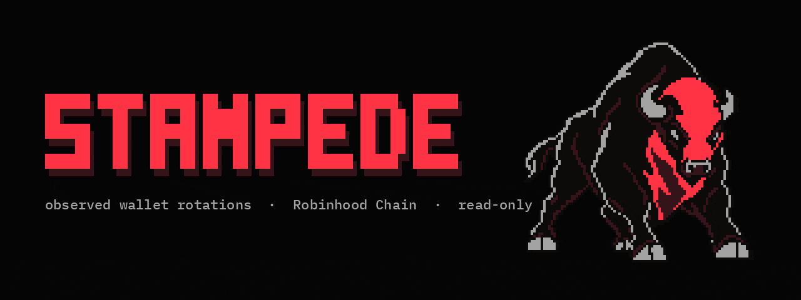
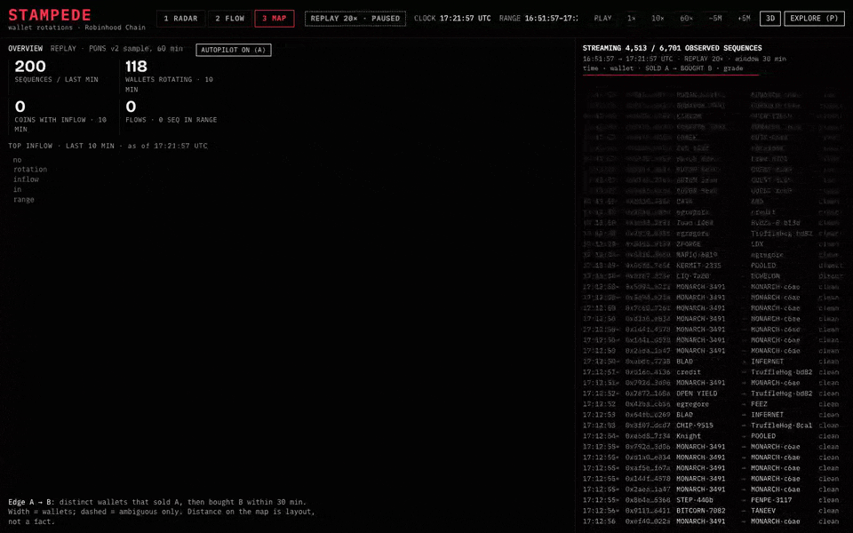
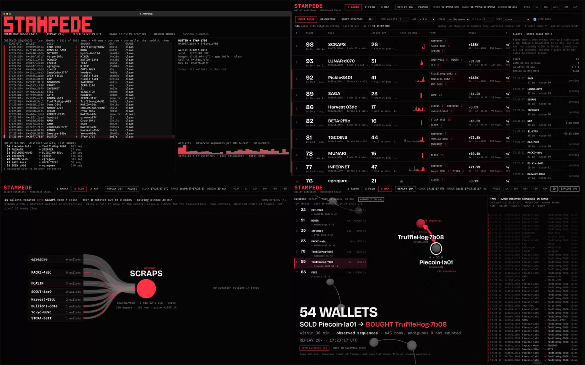

<p align="center">
  <a href="docs/assets/hero-static.png"></a>
</p>

<p align="center">
  
  
  
</p>

**See what wallets sold before they bought the next coin.**

STAMPEDE is a read-only explorer of *observed* wallet rotations on supported Robinhood Chain venues
(PONS v2 bonding curves and the Uniswap v4 pools their coins graduate into). A rotation is one address that
sold coin A and, inside a chosen window, bought coin B. The tool shows those sequences as a live feed, a
ranked board, a flow diagram and a spatial map — always with the addresses, timestamps and transaction
hashes behind every number. It does not claim that the sale funded the purchase, that addresses share an
owner, or that anything will happen next.

**[Start here — step-by-step setup](docs/GETTING-STARTED.md)** — from an empty Terminal to your first observed
sell → buy sequence and its transactions, on the recorded sample, with no API keys.

[Quickstart](#quickstart) · [Watch demo](#watch-demo) · [How it works](#how-it-works) · [Data & limits](#data--limits)

## Watch demo

<a href="docs/DEMO-V5.md"></a>

Recorded replay · 20× · not a live market feed. The full 44-second take (terminal intro, four autopilot stops,
RADAR, FLOW): [`stampede-v5-autopilot.mp4`](https://github.com/Argona7/stampede/releases/download/v0.1.0/stampede-v5-autopilot.mp4)
(16.7 MB, release asset); frame-by-frame notes in [`docs/DEMO-V5.md`](docs/DEMO-V5.md).

## Quickstart

The release ships a recorded sample — 60 minutes of PONS v2 trading on Robinhood Chain
(2026-09-10 16:29:57–17:29:57 UTC), 146,329 trades, 33,743 wallets, 12,164 observed sequences in the
30-minute window — and replaying it needs no Alchemy, Twitter or other API key. Requirements: Git,
[uv](https://docs.astral.sh/uv/) (it installs Python 3.13 itself), Node 22+ only for the web views.

```sh
git clone https://github.com/Argona7/stampede && cd stampede
uv sync
cd web && npm ci && npm run build && cd ..      # web views; skip for terminal-only
uv run stampede demo                            # fetches the 17 MB sample once, then http://127.0.0.1:8791/  (replay 20x, paused)
```

Press `Play` (or `space`) in the browser. Terminal UI in a second window (120×36 or larger), on the same clock:
`uv run stampede terminal --api-url http://127.0.0.1:8791`. First time here? The
[step-by-step guide](docs/GETTING-STARTED.md) explains each command, what you should see, and what to do when
something goes wrong.

The sample bundle comes from the [v0.1.0 release](https://github.com/Argona7/stampede/releases/tag/v0.1.0)
(`data/demo/`, unpacked to 139 MB in `data/demo.sqlite`); offline or mirrored setups put `stampede-demo.sqlite.xz`
there themselves or point `--bundle-url` / `STAMPEDE_DEMO_URL` at another copy. Live mode (Alchemy key in `.env`,
`uv run stampede serve --mode live`) is documented in [`docs/DEVELOPMENT.md`](docs/DEVELOPMENT.md); keys are read
from `.env` only and never printed.

## Four views, one dataset



| The question | What STAMPEDE shows | Where |
|---|---|---|
| which coins are wallets rotating *into* right now? | distinct wallets per 10 minutes, acceleration, breadth of origins, wallet quality, age, curve stage — one score with every part visible | `RADAR` · terminal `Tab` |
| where did the wallets of this coin come from, where did they go? | sources left, destinations right, ribbon width = distinct wallets, a click opens the transactions | `FLOW` · coin drawer `D` |
| what does the whole hour look like? | coins as nodes, observed rotations as directed edges, pulses where sequences just landed, autopilot over the strongest routes | `MAP` · `A` |
| show me the exact trades | wallet, sell tx, buy tx, gap, grade — with Blockscout links; distinct wallets and sequence rows counted separately | evidence `E` · terminal feed |

TERMINAL — `stampede terminal`, the stream of observed sequences on the replay clock plus a Radar screen; RADAR, FLOW and MAP are the web views. Score parts, presets and context modules: [`docs/RADAR.md`](docs/RADAR.md).

## From an event to evidence

One row from the recorded sample, taken from the same route the demo flies to:

| Step | Observed fact | Where to check |
|---|---|---|
| Wallet | `0xd60c7abcc6b15c26c525c0dd8828ffde32b07ab6` | [address on Blockscout](https://robinhoodchain.blockscout.com/address/0xd60c7abcc6b15c26c525c0dd8828ffde32b07ab6) |
| Sell | 3,640,335 Piecoin for 22.848 USDG on the PONS curve, block 59570827, 2026-09-10 17:10:09 UTC | [tx 0x17da…a56d](https://robinhoodchain.blockscout.com/tx/0x17dacbaa69834e67fc52c26303dd9c85e9966e30b9d047388f2f60cd20a8a56d) |
| Buy | 9,788,825 TruffleHog for 49.159 USDG on the PONS curve, block 59579393, 2026-09-10 17:24:35 UTC | [tx 0x20ed…4729](https://robinhoodchain.blockscout.com/tx/0x20ed0eef6f879b6b1004a8fdf44a6d99642dc380c0aa3604063e95ea9f554729) |
| Sequence | `sell Piecoin → buy TruffleHog`, gap 866 s, grade *clean* (the wallet sold nothing else in the window) | `/api/edge/0x6c36…1a01/0x4ad5…7b08`, or `E` on the route in MAP |
| Edge | 54 distinct wallets with direct/clean sequences on this route in the 30-minute window; 883 sequence rows, because a wallet that sold once and bought nine times counts nine rows and one wallet | the evidence card says both numbers; the edge weight uses wallets |

Grades: *direct* — sell and buy in the same transaction; *clean* — the wallet sold only A in the window;
*ambiguous* — it also sold other coins, listed but never counted in the weight. More checked examples,
including negative cases, in [`docs/EXAMPLES.md`](docs/EXAMPLES.md).

## How it works

```
Robinhood Chain logs ──▶ ingest (Alchemy / public RPC / HyperSync)
        │                      swap events + ERC-20 transfers, PONS lifecycle events
        ▼
   normalize ──▶ trades         who traded what (Transfer-based attribution), exact block times
        ▼
   rotate ──▶ sequences         sell A → buy B by the same wallet inside 5 min / 30 min / 2 h, graded
        ▼
   serve ──▶ FastAPI            one shared session clock: fixture | replay | live
        │                        radar score, context modules, alert journal with outcomes
        ├──▶ web/ (Vite + React + three.js)   RADAR · FLOW · MAP
        └──▶ stampede terminal (Textual)      FEED · RADAR
```

**What it does.** Reads public chain data, keeps every trade it derives with its transaction hash, and shows
sequences in the order they happened. Replay and live are separate modes and labelled on every screen. The
radar score is a ranking of observed inflow with all parts visible; the alert journal records what fired and
what the price did 30 and 60 minutes later, measured on indexed trades.

**What it does not.** It does not prove money flow between coins, does not attribute addresses to people or
teams, does not send anything to the chain, and does not promise returns. The research note
[`docs/RESEARCH-RUNNERS.md`](docs/RESEARCH-RUNNERS.md) measures how often a coin with a given inflow doubled
within 30 minutes in one five-hour sample — a description of that sample, not a forecast, and most such spikes
ended below the alert price by the end of the horizon.

## Data & limits

- Venues: PONS v2 bonding curves and graduated Uniswap v4 pools (V2MemeHook) on Robinhood Chain (chain id 4663). Other DEXes and plain transfers are outside the universe ([`docs/ALGORITHM.md`](docs/ALGORITHM.md)).
- Sample: one recorded hour, verified against receipts; counts, rejected cases and the block-time method in [`docs/COVERAGE.md`](docs/COVERAGE.md). Coins with the same ticker are disambiguated by the last four hex digits of the address (`Piecoin·1a01`).
- Attribution: the wallet is the address whose ERC-20 balance changed, not the transaction sender; swaps that net to zero or spread tokens over several recipients produce no trade.
- Timestamps: exact block times where fetched, interpolated otherwise; interpolated times carry `≈` in the terminal and the tape and *(approx.)* in the evidence rows.
- External context (GeckoTerminal market data, holders via public RPC, X mentions) is fetched in live mode only, cached with its fetch time, and off in `stampede demo`.
- Measured source behaviour (rate limits, log ranges, head lag) in [`docs/SOURCES.md`](docs/SOURCES.md).

## Development

```sh
uv sync && uv run pytest -q                     # 48 tests: normalization, rotation, radar, session, TUI, demo bundle
cd web && npm ci && npm run build && npm run lint
python scripts/serve_daemon.py start --mode replay   # serves data/stampede.sqlite on :8791 (own recorded store)
cd web && npx playwright test                   # 8 end-to-end tests against the running server
```

Record your own sample with a free Alchemy key: `uv run stampede ingest --minutes 60`, `normalize --reset`,
`rotate --all-windows`, `verify --n 200`, `report`; pack it for others with `stampede export-demo`.
Full command reference, keys, API and layout: [`docs/DEVELOPMENT.md`](docs/DEVELOPMENT.md). Demo edit notes
and frame timings: [`docs/DEMO-V5.md`](docs/DEMO-V5.md).

Known limits: the sample is one hour of one launchpad; radar thresholds were calibrated on five hours;
`live` depends on Alchemy's free-tier limits (10-block `getLogs`, 429s under load); the 3D scene needs WebGL 2.

Roadmap (planned, not shipped): (1) live mode on the public RPC alone, without an Alchemy key;
(2) export of a route's evidence rows as CSV/JSON from the UI; (3) multi-hour recorded samples published as
release assets alongside the 60-minute one.

Contributing: open an issue with the transaction hashes you looked at; pull requests keep the honesty rules
in `docs/ALGORITHM.md` (no claims beyond observed order of trades). License: not chosen yet — until a
LICENSE file lands, the code is source-available for reading and running the demo, not for redistribution.
