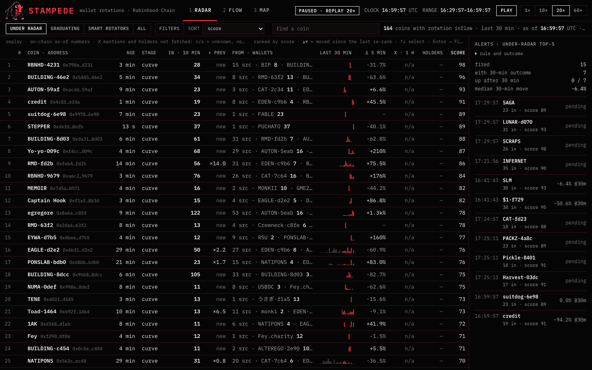
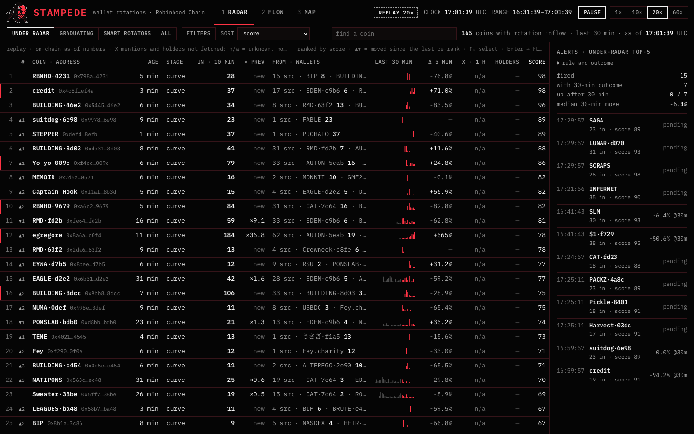
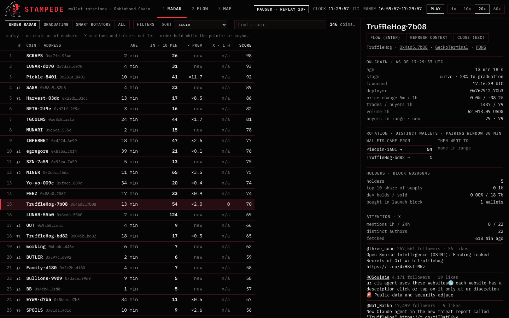
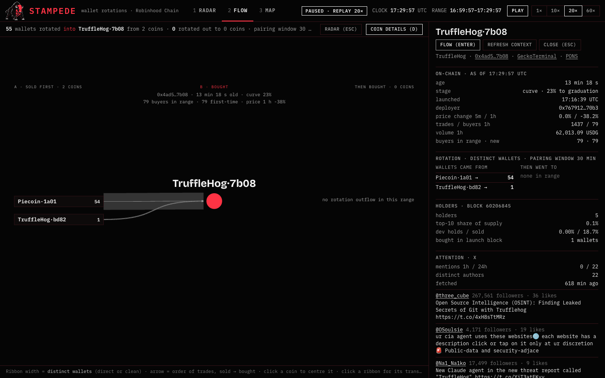
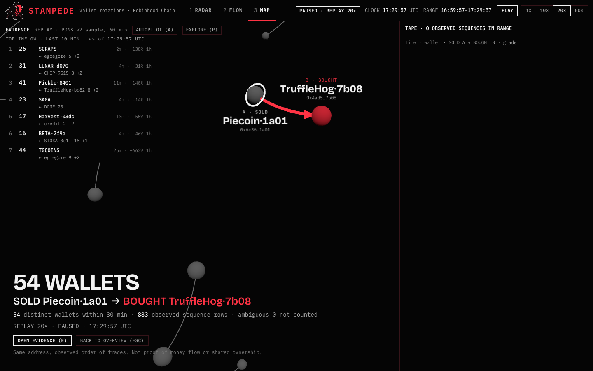
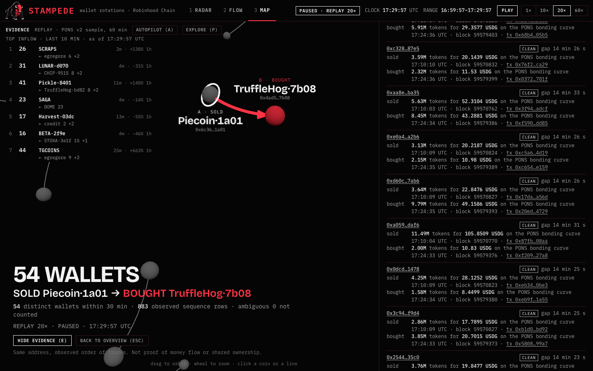
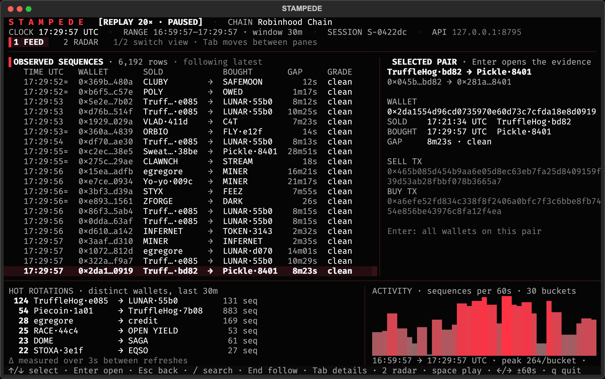
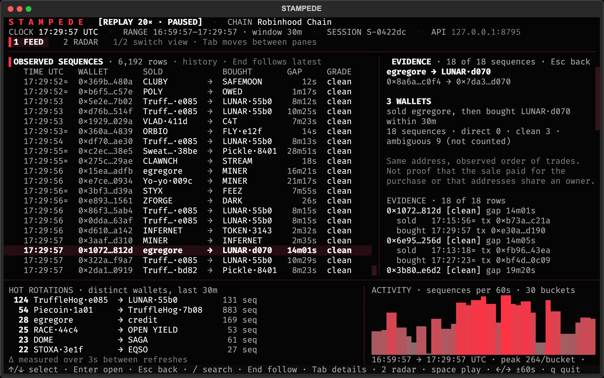

# Getting started with STAMPEDE — step by step

This page takes you from an empty Terminal to your first observed wallet rotation with its transactions open.
Four things to know before you start:

- **You are running existing software, not building it with an AI agent.** Every command below runs code that is already in this repository.
- **The demo uses recorded trades. It starts paused; press Play to see it move.** A frozen screen right after start is not an error.
- **The recorded demo needs no API keys and no wallet connection.** The first setup still needs internet: it downloads the dependencies and the 17 MB sample.
- **The web view opens on your own computer at a localhost address** (`http://127.0.0.1:8791/`). It is not a public hosted dashboard; nobody else sees it.

Verified path: macOS (26.5.1, Apple silicon) with the versions listed in step 1. **Windows and Linux are not verified**; the
commands are the same in principle, but nobody has run them there for this guide. The record of the verification run is in
[`GETTING-STARTED-VERIFICATION.md`](GETTING-STARTED-VERIFICATION.md).

**Contents**

1. [Prepare your computer](#1-prepare-your-computer)
2. [Download STAMPEDE](#2-download-stampede)
3. [Build the web interface once](#3-build-the-web-interface-once)
4. [Start the demo and open the browser](#4-start-the-demo-and-open-the-browser)
5. [See your first result](#5-see-your-first-result)

Then: [the real terminal (optional)](#optional-the-real-terminal-terminal-2) · [stop, restart, update](#stopping-restarting-updating) ·
[troubleshooting](#troubleshooting) · [reporting a problem](#reporting-a-problem) · [live chain data](#want-current-chain-data-live-setup-) ·
[web keyboard map](#web-keyboard-map).

How to read the command blocks: copy the text inside a grey block and paste it into the Terminal window, then press
Return. There is no `$` prompt to copy. Each block is one step; run the blocks in order, in the same window, unless the
text says `Terminal 2`.

---

## 1. Prepare your computer

**Action.** Open a Terminal and check that four tools are installed.

On macOS: press `⌘ Space`, type `Terminal`, press Return (or Finder → Applications → Utilities → Terminal). A window with a
blinking cursor opens in your home folder. This window is **Terminal 1 — server** for the rest of the guide.

**Command.** Run the four checks:

```sh
git --version
uv --version
node --version
npm --version
```

**Expected result.** Four version lines, one per command. The guide was verified with:

```text
git version 2.50.1 (Apple Git-155)
uv 0.11.21 (5aa65dd7a 2026-06-11 aarch64-apple-darwin)
v26.3.0
11.16.0
```

Those are the verified versions; Node.js must be 22 or newer (npm comes with Node), any recent Git and uv should do. You
do **not** install Python yourself: `uv` downloads CPython 3.13 on its own during step 2 (the project pins `3.13` in
`.python-version`). No AI subscription, no account, no wallet is needed.

**Typical error.** `command not found: git` (or `uv`, `node`, `npm`) → that tool is missing. Install it, then **open a new
Terminal window** (the old one does not see freshly installed tools) and run the check again:

| Tool | Install |
|---|---|
| `git` | macOS: run `xcode-select --install`, or download from <https://git-scm.com/downloads> |
| `uv` | <https://docs.astral.sh/uv/getting-started/installation/> (one `curl … \| sh` line; the page also shows the Homebrew and Windows commands) |
| `node` + `npm` | <https://nodejs.org/> — the LTS installer (22 or newer) |

---

## 2. Download STAMPEDE

**Action.** Copy the repository to your computer and enter its folder.

```sh
git clone https://github.com/Argona7/stampede
cd stampede
```

`git clone` creates a folder called `stampede` inside the folder you are in (your home folder if you just opened
Terminal). `cd stampede` moves into it. **Remember this location** — Terminal 2 will need it later. `pwd` prints where you
are; `ls` should list `README.md`, `pyproject.toml`, `stampede`, `web`, `docs`.

**Action.** Create the Python environment.

```sh
uv sync
```

**Expected result.** The first run prints something like `Using CPython 3.13.14`, `Creating virtual environment at:
.venv`, `Resolved 37 packages`, `Installed 36 packages` and a list of `+ package==version` lines; the last line is the
prompt again, with no `error`. A hidden `.venv` folder now exists inside `stampede`. If uv has to download Python and the
packages, this takes a minute or two on a normal connection; on a machine where uv already cached them it took 1 second.

Running `uv sync` again later is normal and fast — it just confirms the environment matches the lockfile.

**Typical errors.**

- `fatal: destination path 'stampede' already exists and is not an empty directory.` → you already cloned it. Do not
  delete anything; just run `cd stampede` and continue with `uv sync`. To keep two copies, clone into another name:
  `git clone https://github.com/Argona7/stampede stampede-2`.
- ``error: No `pyproject.toml` found in current directory or any parent directory`` → you are not inside the `stampede`
  folder. Run `pwd` to see where you are, then `cd` into the folder you cloned (see [Troubleshooting](#troubleshooting)).

---

## 3. Build the web interface once

**Action.** Prepare the browser interface. This is a one-time build that produces static files inside `web/dist`; it does
not start a website and it does not publish anything.

```sh
cd web
npm ci
```

**Expected result.** `added 61 packages, and audited 62 packages in …` and `found 0 vulnerabilities`. With npm 11 you may
also see `npm warn allow-scripts 1 package has install scripts not yet covered by allowScripts: fsevents@2.3.3` — that is a
notice, not an error; nothing to do. The first run downloads the packages and takes longer than the 1 second measured with
a warm cache.

```sh
npm run build
```

**Expected result.** `tsc -b && vite build`, then `✓ 260 modules transformed`, a list of `dist/assets/…` files and
`✓ built in …ms`. The note `(!) Some chunks are larger than 500 kB after minification` is expected and harmless. A `dist`
folder (about 1.5 MB) now exists inside `web`.

```sh
cd ..
```

This returns you to the `stampede` folder. You are still in Terminal 1.

**Typical errors.**

- `npm error code EUSAGE … The npm ci command can only install with an existing package-lock.json` or
  `npm error enoent Could not read package.json` → you ran `npm` in the wrong folder (the repository root instead of `web`).
  Run `cd web` and try again; after the build, `cd ..` brings you back.
- Any other `npm error` → first check `node --version`; it must be `v22` or newer. If it is not, install the current LTS
  from <https://nodejs.org/>, open a new Terminal window, `cd` back into `stampede/web`, and rerun `npm ci`.

---

## 4. Start the demo and open the browser

**Action.** Start the recorded demo. You must be in the `stampede` folder (Terminal 1).

```sh
uv run stampede demo
```

**Leave this terminal open. The command keeps running because it is the server. That is expected. Open
<http://127.0.0.1:8791/> in your browser.**

**Expected result.** On the very first start the server downloads the recorded sample from the public GitHub release and
unpacks it:

```text
fetching demo bundle (https://github.com/Argona7/stampede/releases/download/v0.1.0/stampede-demo.sqlite.xz) → …/stampede/data/demo/stampede-demo.sqlite.xz
```

The bundle is 17.1 MB (`stampede-demo.sqlite.xz`); it unpacks to a 139 MB `data/demo.sqlite`. In the verification runs the
download plus unpack took between 6 and 37 seconds; there is no progress bar, the terminal just looks idle until the
next lines appear:

```text
STAMPEDE demo · recorded sample "PONS v2 sample, 60 min" · 146,329 trades · 12,164 observed sequences (windows: 30 min) · replay 20×
no API keys are read in this mode; external context (X, GeckoTerminal, holders) stays off
web:      http://127.0.0.1:8791/
terminal: uv run stampede terminal --api-url http://127.0.0.1:8791
controls: space play/pause · ←/→ seek · [ ] speed · q quit
```

Later starts skip the download (the bundle and the unpacked database stay in `data/`) and are ready in about 2 seconds.
Everything runs from local files after that; the demo itself never calls an API.

Now open <http://127.0.0.1:8791/> in Safari, Chrome or Firefox. You should see the black RADAR table with the pixel bison
and `STAMPEDE` in the top-left, the badge `PAUSED · REPLAY 20×`, `CLOCK 16:59:57 UTC` and a `PLAY` button:



*Step 4 done: STAMPEDE serving the recorded sample, paused at 16:59:57 UTC, 164 coins on the RADAR.*

**Typical errors.**

- `ERROR: [Errno 48] error while attempting to bind on address ('127.0.0.1', 8791): [errno 48] address already in use` →
  something else already listens on port 8791 (often an earlier STAMPEDE you forgot about). Do not kill unknown processes;
  start on another port instead:

  ```sh
  uv run stampede demo --port 8793
  ```

  and open <http://127.0.0.1:8793/>. Every other URL in this guide then uses `8793` too (the terminal UI needs
  `--api-url http://127.0.0.1:8793`). Pick any free port; 8793 is only an example.
- `error: Failed to spawn: stampede` · `Caused by: No such file or directory (os error 2)` → you are not inside the
  `stampede` folder; `cd` into it.
- `requests.exceptions.HTTPError: 404 Client Error: Not Found for url: …` or
  `requests.exceptions.ConnectionError: … Failed to establish a new connection` right after `fetching demo bundle` → the
  download failed. See [Running](#running) for the manual route (no keys involved).
- The page shows ``{"stampede":"API only — build the web terminal with `cd web && npm run build`", …}`` instead of the
  interface, and the server printed `web:      not built — cd web && npm ci && npm run build` → step 3 was skipped or
  failed. Do step 3, then reload the page (the server keeps running; no restart needed).

---

## 5. See your first result

You will follow one observed route from the recorded hour: **54 wallets sold `Piecoin·1a01` and then bought
`TruffleHog·7b08` within 30 minutes.** Same route the README and the demo video use, so you can compare.

### 5.1 Press Play

**Action.** Click **`PLAY`** at the top right (or press `Space`). The badge changes to `REPLAY 20×`, the button reads
`PAUSE`, the clock starts moving 20 recorded seconds per real second, and rows in the RADAR table start changing; red
marks flag rows whose numbers just moved.



*The replay running. Red marks on the left show ranks that moved since the last re-rank.*

**Expected result.** The clock runs from 16:59:57 to 17:29:57 UTC in about **90 seconds** and then **pauses itself** at the
end of the recorded hour (badge back to `PAUSED · REPLAY 20×`). Let it run to the end: the rest of this step describes the
screen at 17:29:57 UTC, so your numbers match the screenshots. Pressing `PLAY` at the end starts the same 30 minutes again
from 16:59:57.

**Typical error.** Nothing moves after a minute → look at the badge. `PAUSED · REPLAY 20×` means nobody pressed Play
yet (press it). `API unreachable · …` in the strip or an `API not reachable` box on the MAP means the server in Terminal 1
stopped — check that window.

### 5.2 Read one RADAR row

`RADAR` is a ranking of *observations*: coins that wallets are rotating **into** right now. One row = one coin.

**Action.** Find the row **`TruffleHog·7b08`** (address `0x4ad5…7b08`). At 17:29:57 UTC it is rank **15** in the default
`UNDER RADAR` preset. If you do not see it, type `truffle` into the `find a coin` box in the working row and click
`TruffleHog·7b08` in the list; that selects the coin and opens its details.

**What the row says** (columns left to right): rank `15` · coin `TruffleHog·7b08` and its short address · `AGE 13 min`
(since launch) · `STAGE curve 23%` (still on the PONS bonding curve, 23 % to graduation) · **`IN · 10 MIN 54`** = 54
distinct wallets sold some other coin and bought this one in the last 10 minutes · `× PREV ×2.0` = twice the inflow of the
previous 10 minutes (acceleration) · `FROM · WALLETS 2 src · Piecoin·1a01 53 · TruffleHog·bd82 1` = which coins those
wallets sold first · `X · 1 H` and `HOLDERS` = external context (mostly `n/a` / `—` in the recorded demo — unknown, not
zero; a few coins carry values cached when the sample was recorded) · `SCORE 70`.

**Action.** Click the row. It turns dark red and the coin drawer opens on the right (`ON-CHAIN · AS OF 17:29:57 UTC`,
`ROTATION · DISTINCT WALLETS`: `Piecoin·1a01 → 54`). You can also move the selection with `↑` `↓`; `D` hides and shows
the drawer.



*Row 15 selected; the drawer shows where its wallets came from: Piecoin·1a01 → 54.*

### 5.3 Open FLOW for that coin

**Action.** Click **`FLOW (ENTER)`** in the drawer (or press `Enter` while the row is selected, or press `2`).

**Expected result.** The FLOW diagram of `TruffleHog·7b08`: on the left, under `A · SOLD FIRST · 2 COINS`, the coins its
buyers sold before — `Piecoin·1a01 54` and `TruffleHog·bd82 1`; the red node in the middle is `B · BOUGHT`; the right
column `THEN BOUGHT · 0 COINS` is empty because nobody had rotated out of it yet at this clock. The working row reads
`55 wallets rotated into TruffleHog·7b08 from 2 coins · 0 rotated out to 0 coins · pairing window 30 min`. Ribbon width =
distinct wallets.



*FLOW: 54 wallets sold Piecoin·1a01, then bought TruffleHog·7b08.*

**Typical error.** `No coin selected — Pick a coin in RADAR…` → FLOW needs a coin; press `1`, click a row, then `Enter`.

### 5.4 Open the evidence: address, sell tx, buy tx, time

**Action.** Hover the grey ribbon between `Piecoin·1a01` and the red node — the tooltip says
`54 wallets sold Piecoin·1a01, then bought TruffleHog·7b08 · click for the transactions` — and **click the ribbon itself**
(clicking the `Piecoin·1a01` label box re-centres the diagram on Piecoin instead).

**Expected result.** The view switches to `MAP` in presentation layout, flies to the route and shows the caption
**`54 WALLETS · SOLD Piecoin·1a01 → BOUGHT TruffleHog·7b08 · 54 distinct wallets within 30 min · 883 observed sequence
rows · ambiguous 0 not counted`**.



*The route on the MAP with its caption. `OPEN EVIDENCE (E)` lists the transactions.*

**Action.** Click **`OPEN EVIDENCE (E)`** (or press `E`). The evidence panel opens on the right:
`Piecoin·1a01 → TruffleHog·7b08 · 54 distinct wallets · 883 sequence rows (60 most recent shown)`. Each block is one
observed sequence of one wallet:

- the wallet address (link to Blockscout), the grade `CLEAN` and the gap between the two trades;
- `sold` — amount, quote, venue, **time UTC, block, `tx …` link**;
- `bought` — the same for the purchase.

Scroll down a little to the block **`0xd60c…7ab6 · CLEAN · gap 14 min 26 s`** (14th in the list):
`sold 3.64M tokens for 22.8476 USDG on the PONS bonding curve 17:10:09 UTC · block 59570827 · tx 0x17da…a56d` and
`bought 9.79M tokens for 49.1586 USDG on the PONS bonding curve 17:24:35 UTC · block 59579393 · tx 0x20ed…4729`.
Click `tx 0x17da…a56d`: the transaction opens on Robinhood Chain's Blockscout in a new tab. Those two transactions are
the whole claim: this address sold Piecoin at 17:10:09 and bought TruffleHog at 17:24:35.



*Evidence rows. Wallet `0xd60c…7ab6`: sell `tx 0x17da…a56d` 17:10:09 UTC → buy `tx 0x20ed…4729` 17:24:35 UTC.*

**Distinct wallets vs sequence rows.** `54 distinct wallets` counts addresses. `883 sequence rows` counts sell→buy pairs:
`0xd60c…7ab6` sold Piecoin once and bought TruffleHog four times inside the window, so it appears in four rows and counts
as **one** wallet. The edge weight everywhere in STAMPEDE uses wallets, never rows. The RADAR row said `54` for the last
10 minutes and `Piecoin·1a01 53` in `FROM`; the evidence panel counts the whole 30-minute range, which is why the two
screens can differ by one or two.

### 5.5 Optional: the same data on the MAP

Press `Esc` (`BACK TO OVERVIEW`) to leave the evidence. In the presentation layout the corner buttons `AUTOPILOT (A)` and
`EXPLORE (P)` are available: **autopilot** flies to the strongest routes one after another and opens their captions;
**any click, wheel or key stops it**. `EXPLORE (P)` switches to the working layout with the range slider, the edge filters
and the details panel, where the same evidence rows appear when you click a line. The 3D scene needs WebGL 2; the `2D`
button in the working row is the fallback. Come back to the evidence rows afterwards — the flight is presentation, the
rows are the product.

**You can now follow an observed sell → buy sequence and open its underlying transactions.** That is the result. STAMPEDE
does not claim the sale paid for the purchase, that addresses share an owner, or that anything will happen next.

---

## Optional: the real terminal (Terminal 2)

The same data as a full-screen terminal UI, on the same server clock.

1. Keep **Terminal 1** with `stampede demo` running.
2. Open a **second Terminal window** (`⌘ N` in Terminal, or Spotlight → Terminal again). This is **Terminal 2 — optional
   TUI**. A new window starts in your home folder, **not** in the `stampede` folder — go there first. If you cloned in your
   home folder that is just:

   ```sh
   cd stampede
   ```

   If you cloned somewhere else, use that path, for example `cd ~/Downloads/stampede` or `cd ~/code/stampede`. `ls` must
   show `pyproject.toml`.
3. Make the window at least **120 columns × 36 rows** (drag a corner; `⌘ −` makes the font smaller if the screen is
   small). Terminal.app, iTerm2, kitty and WezTerm are listed as working in the README; the frames below are the TUI's own
   renderer at exactly 120×36.
4. Start the terminal UI:

   ```sh
   uv run stampede terminal --api-url http://127.0.0.1:8791
   ```

   If your server runs on another port (step 4), put that port in the URL.

**Expected result.** The FEED screen: `S T A M P E D E · [REPLAY 20× · PAUSED] · CHAIN Robinhood Chain`, the clock and
range, the `OBSERVED SEQUENCES` table (time, wallet, sold → bought, gap, grade), the `SELECTED PAIR` pane on the right,
`HOT ROTATIONS` and an `ACTIVITY` sparkline below, and one line of keys at the bottom. In a window of 160 columns or more
the header grows to the big block wordmark with the brand mark beside it.



*`stampede terminal` at 120×36 on the demo server. `HOT ROTATIONS` lists the same route: 54 Piecoin·1a01 → TruffleHog·7b08, 883 seq.*

**Keys** (the bottom line shows the same words): `↑` `↓` select a row · `Enter` opens the evidence for the selected pair
(or the coin card on RADAR) · `Esc` goes back · `Tab` moves the focus between the table and the details pane · `1` FEED,
`2` RADAR · `/` search by symbol or address · `End` follow the latest rows, `Home` first row · `Space` play/pause ·
`←` `→` seek −/+60 s · `[` `]` slower / faster · `u` `g` `s` `a` RADAR presets · `q` quit.



*`↑ ↑ Enter` on the feed: the EVIDENCE pane for one pair, with the grades and the tx hashes of each row.*

**The browser and the terminal read the same clock.** `Space` in the terminal starts the replay in the browser too; a
seek in the browser moves the terminal. That is expected, not a glitch. Quit with `q`; the server in Terminal 1 keeps
running.

**Typical errors.**

- `API not reachable at http://127.0.0.1:8791: connection refused at 127.0.0.1:8791 (is the server running?)` →
  Terminal 1 is not running `stampede demo`, or it runs on another port. Start it (or fix the `--api-url` port).
- Columns are missing (no `WALLET`), symbols end in `…`, no `HOT ROTATIONS` panel → the window is narrower than 120
  columns or shorter than 36 rows. Enlarge it; the TUI redraws on resize.

---

## Stopping, restarting, updating

- **Quit the terminal UI:** `q` (or `Ctrl+C`) in Terminal 2. The server is not affected.
- **Stop the server:** press `Ctrl+C` in Terminal 1 (the window running `stampede demo`). The browser tab then shows
  `API unreachable` — expected.
- **Start again later:** open Terminal, `cd` into the `stampede` folder, run `uv run stampede demo`. No new clone, no
  `uv sync`, no web build needed; the sample is already in `data/`, so it is ready in about 2 seconds.
- **Update to a newer version** (only when you want to):

  ```sh
  git status
  ```

  If it prints `nothing to commit, working tree clean`, pull the update; otherwise you changed tracked files — look at
  them first, nothing here deletes your data. `data/` (the sample and any database), `.env` and `web/node_modules` are
  ignored by Git and survive a pull.

  ```sh
  git pull
  uv sync
  ```

  ```sh
  cd web
  npm ci
  npm run build
  cd ..
  ```

  Then `uv run stampede demo` as before. `--refresh` re-unpacks the sample if a release ever ships a new bundle:
  `uv run stampede demo --refresh`.

---

## Troubleshooting

Symptom → cause → what to do. Every quoted error text below was reproduced during the verification run on macOS.

### Setup

| Symptom | Cause | Do this |
|---|---|---|
| `zsh: command not found: git` (or `uv`, `node`, `npm`) | The tool is not installed, or the Terminal window is older than the installation | Install it (table in step 1), open a **new** Terminal window, retry |
| ``error: No `pyproject.toml` found in current directory or any parent directory`` (from `uv sync`) | You are not inside the `stampede` folder | `pwd` shows where you are; `cd` into the cloned folder (e.g. `cd ~/stampede`). No need to clone again |
| `error: Failed to spawn: stampede` · `Caused by: No such file or directory (os error 2)` (from `uv run stampede …`) | Same: `uv run` cannot find the project | `cd` into the `stampede` folder, then retry |
| `npm error code EUSAGE … The npm ci command can only install with an existing package-lock.json` or `npm error enoent Could not read package.json … /stampede/package.json` | `npm` ran in the repository root instead of `web/` | `cd web`, then `npm ci` and `npm run build`; `cd ..` afterwards |
| `fatal: destination path 'stampede' already exists and is not an empty directory.` | A previous clone | `cd stampede` and continue; do not delete it |
| `npm warn allow-scripts … fsevents@2.3.3` | npm 11 notice about an optional package's install script | Nothing; the build works |
| `(!) Some chunks are larger than 500 kB after minification` | Vite's size hint | Nothing; the build succeeded |

### Running

| Symptom | Cause | Do this |
|---|---|---|
| The browser cannot connect to `127.0.0.1:8791` (Chrome: `ERR_CONNECTION_REFUSED`; `curl` says `Failed to connect to 127.0.0.1 port 8791 … Couldn't connect to server`) | No server on that port: Terminal 1 is not running `stampede demo`, or it runs on a different port | Look at Terminal 1: is the command still running? Does its `web:` line show the same port as your browser? Start it or fix the URL |
| Terminal 1: `ERROR: [Errno 48] error while attempting to bind on address ('127.0.0.1', 8791): [errno 48] address already in use` | Another program (often an earlier STAMPEDE) listens on 8791 | `uv run stampede demo --port 8793` and open `http://127.0.0.1:8793/`; use that port in `--api-url` too. Do not kill processes you do not know |
| Terminal 1: `fetching demo bundle …` then `requests.exceptions.HTTPError: 404 Client Error: Not Found for url: …` or `requests.exceptions.ConnectionError: … Failed to establish a new connection` — **demo download failed** | No internet, a proxy, or the release asset is unreachable | Check the connection and that <https://github.com/Argona7/stampede/releases/tag/v0.1.0> lists `stampede-demo.sqlite.xz`. Manual route (no keys): download it with the browser or `curl -L -o data/demo/stampede-demo.sqlite.xz https://github.com/Argona7/stampede/releases/download/v0.1.0/stampede-demo.sqlite.xz` from the `stampede` folder, then run `uv run stampede demo` again — it unpacks the file it finds. A mirror works with `--bundle-url <url>` or `STAMPEDE_DEMO_URL` |
| The map / table does not move | The replay is paused (badge `PAUSED · REPLAY 20×`) | Press `PLAY` or `Space`. At the end of the hour (17:29:57 UTC) it pauses by itself; `PLAY` starts over |
| Page shows JSON `{"stampede":"API only — build the web terminal …"}`; Terminal 1 says `web: not built` | `web/dist` is missing: step 3 skipped or failed | Do step 3 (`cd web`, `npm ci`, `npm run build`, `cd ..`), then reload the page. The server can stay running |
| Strip shows `API unreachable · …`; MAP shows `API not reachable … Is stampede demo (or stampede serve) still running in its terminal?` | The server stopped or Terminal 1 was closed | Restart it: `uv run stampede demo` in the `stampede` folder |
| `X · 1 H` shows `n/a`, `HOLDERS` shows `—`, the drawer says `not fetched · external context is off in replay · Refresh context fetches it now (paid calls)` | Recorded demo: external context (X mentions, GeckoTerminal, holders) is switched off on purpose | Nothing is wrong. `n/a` means unknown, not zero. A few coins show values that were cached when the sample was recorded. Leave `Refresh context` alone in the demo |
| MAP shows no 3D scene (not reproduced here — all verification machines had WebGL 2) | The browser has no WebGL 2 | Click `2D` in the MAP working row; RADAR and FLOW do not need WebGL |
| Terminal UI: `API not reachable at http://127.0.0.1:8791: connection refused …` | Server not running / other port | Start `stampede demo`, or pass the right `--api-url` |
| Terminal UI cramped: no `WALLET` column, symbols cut to `…`, no `HOT ROTATIONS` | Window smaller than 120×36 | Enlarge the window or reduce the font (`⌘ −`); it redraws on resize |

## Reporting a problem

Open an issue at <https://github.com/Argona7/stampede/issues> with:

```text
OS and version:        (e.g. macOS 26.5.1)
STAMPEDE commit:       output of `git rev-parse --short HEAD` in the stampede folder
Tool versions:         git / uv / node / npm --version
Step in this guide:    (e.g. 4 — start the demo)
Command you ran:
What happened:         the error text, copied as is
```

Never paste your `.env` file, API keys, private keys or seed phrases. The demo does not use any of them, and no error
message needs them.

---

## Want current chain data? Live setup →

**Not covered by this guide and not verified in its verification run.** The recorded demo is the supported path. Live mode
(`uv run stampede serve --mode live`) tails the chain head and needs an Alchemy key in `.env`; the commands, environment
variables and modes are documented in [`DEVELOPMENT.md`](DEVELOPMENT.md). Expect first-time indexing and provider rate
limits; the interface labels live data `LIVE` and shows a provider error instead of a frozen picture. Test it on a
separate port and a separate store while the demo runs.

---

## Web keyboard map

Verified in the final interface (`Space` and the letters work when no text field has the focus):

| Key | Where | Action |
|---|---|---|
| `1` `2` `3` | everywhere | RADAR / FLOW / MAP |
| `←` `→` `Home` `End` | view tabs focused | move between the tabs |
| `↑` `↓` | RADAR | move the coin selection (the drawer follows) |
| `Enter` | RADAR | open FLOW for the selected coin |
| `D` | RADAR, FLOW | show / hide the coin drawer |
| `Esc` | everywhere | close the drawer → back to RADAR from FLOW → clear the selection |
| `Space` | everywhere | play / pause the shared clock |
| `E` | MAP (presentation) | open / hide the evidence rows of the selected route |
| `P` | MAP | presentation ↔ explore layout |
| `A` | MAP presentation | autopilot on / off; any other key, click or wheel stops it |
| click on the bison / `STAMPEDE` | everywhere | back to the start view; clock, filters and selection stay |
